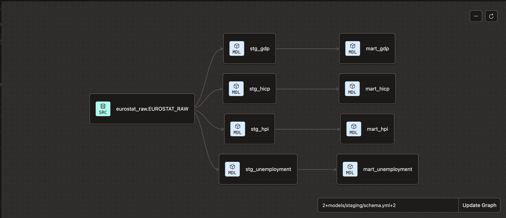
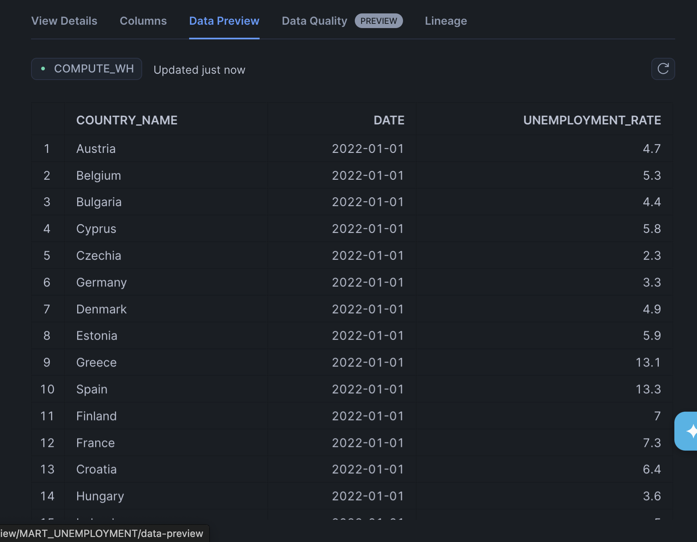
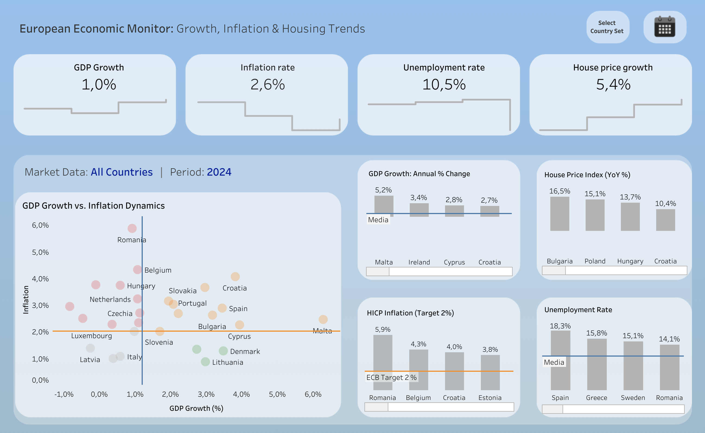
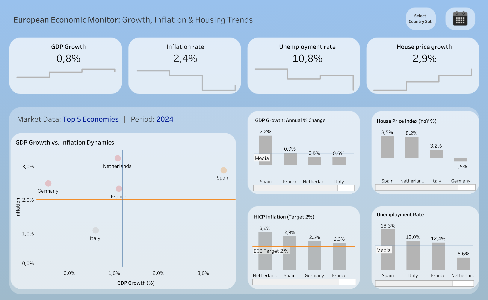

# 🇪🇺 EU Economic Monitor (2015-2025)

## Project Overview
End-to-end analytics engineering project tracking key macroeconomic indicators 
across EU member states: **GDP Growth**, **House Price Index (HPI)**, 
**Inflation (HICP)**, and **Unemployment Rates**.

Built to demonstrate a modern Analytics Engineering stack — from raw API 
ingestion to transformed data models ready for visualization.

## Architecture

## Tech Stack
| Layer | Tool |
|-------|------|
| Ingestion | Python (`requests`, `snowflake-connector`) |
| Storage | Snowflake (VARIANT → structured tables) |
| Transformation | dbt Core (staging + mart models) |
| Visualization | Tableau Public |
| Version Control | GitHub |

### Data Lineage

### Data Preview

## Data Sources
All data sourced from **Eurostat API**:
| Dataset | Code | Granularity |
|---------|------|-------------|
| GDP | `namq_10_gdp` | Quarterly |
| House Price Index | `prc_hpi_q` | Quarterly |
| Inflation (HICP) | `prc_hicp_manr` | Monthly |
| Unemployment | `une_rt_m` | Monthly |

## Project Structure

## dbt Methodology
**Staging layer** — parses raw Eurostat JSON (VARIANT) into clean tabular 
format using `LATERAL FLATTEN` and Snowflake semi-structured data functions.

**Mart layer** — applies business logic:
- Date standardization (`YYYY-MM-DD`)
- YoY growth calculations using `LAG()` window functions
- Final tables ready for Tableau connection

## Data Quality
dbt tests applied on all staging models:
- `not_null` on all key columns (country_code, country_name, time_period, obs_value)

## Visualizations
### [🔗 Live Dashboard](https://public.tableau.com/app/profile/mykyta.loiko/viz/EUsTop5Economies-GrowthandInflationDynamics2025/Dashboard_1?publish=yes)

### Dashboards Preview
#### 1. Top 10 Economies

#### 2. European Economic Map

#### 3. 2024 Economic Outlook

## Author
**Mykyta Loiko** — Analytics Engineer
[LinkedIn](https://www.linkedin.com/in/mykyta-loiko-9a9ab813a/) | 
[Tableau Public](https://public.tableau.com/app/profile/mykyta.loiko)
