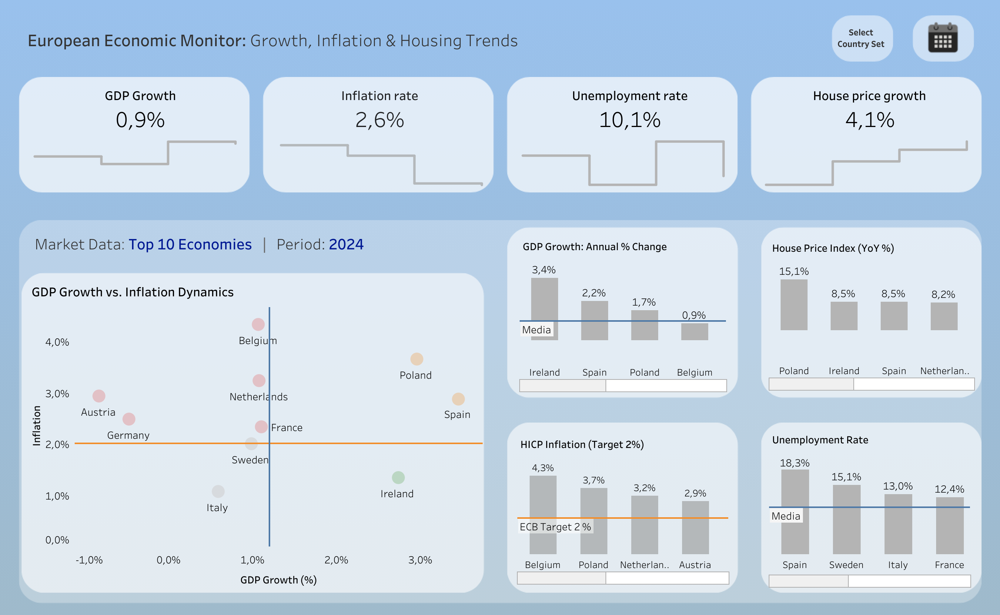

# European Economic Monitor (2022-2025)

## Project Overview
This project provides a comprehensive analysis of key economic indicators across European countries, including **GDP Growth**, **House Price Index (HPI)**, **Inflation (HICP)**, and **Unemployment Rates**. 

The goal is to visualize the correlation between macroeconomic shifts and the real estate market.

## Data Sources
All data is sourced from **Eurostat**:
- GDP: `namq_10_gdp`
- House Price Index: `prc_hpi_qinn`
- Inflation (HICP): `prc_hicp_manr`
- Unemployment: `une_rt_m`

## Tech Stack
- **SQL (SQLite/DBeaver):** Data extraction, cleaning, and Year-over-Year (YoY) growth calculations using Window Functions.
- **Tableau:** Interactive dashboarding and time-series visualization.
- **GitHub:** Project documentation and version control.

## SQL Methodology
In this project, I handled different data granularities (Monthly and Quarterly) by:
1. **Window Functions:** Used `LAG()` to calculate YoY growth rates for GDP and HPI.
2. **Data Transformation:** Standardized all time periods into a `Tableau_Date` format (`YYYY-MM-DD`) for seamless joining in Tableau.
3. **Data Cleaning:** Filtered specific demographic categories (e.g., Age 25-74) to ensure data consistency.

## Visualizations
### [ Live Dashboard Link](https://public.tableau.com/app/profile/mykyta.loiko/viz/EUsTop5Economies-GrowthandInflationDynamics2025/Dashboard_1?publish=yes)

## Dashboards Preview
### 1. Top 10 Economies

### 2. European Economic Map

### 3. 2024 Economic Outlook

## Contact
Created by [Mykyta Loiko]. 
Connect with me on [(https://www.linkedin.com/in/mykyta-loiko-9a9ab813a/)].
